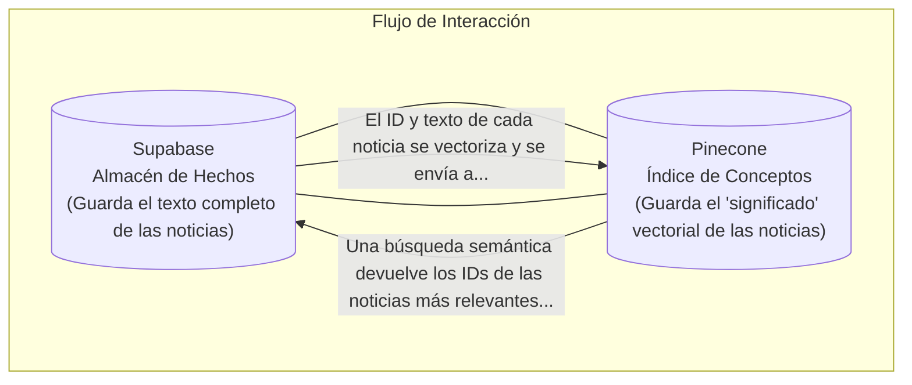

# Arquitectura de la Base de Conocimiento

Este diagrama explica la relación simbiótica entre Supabase y Pinecone, que juntos forman la "memoria" a largo plazo de Quantex.

### Explicación del Flujo

1.  **Supabase (La Biblioteca):** Actúa como el archivo maestro. Contiene la información cruda y verificable, como el texto completo de los resúmenes de noticias y los datos de mercado. Es la fuente de la verdad.
2.  **Pinecone (El Bibliotecario Inteligente):** No guarda la información completa, solo su "esencia" o "significado" en forma de vectores. Actúa como un índice temático súper avanzado.
3.  **La Colaboración:** Cuando una nueva noticia es procesada, se guarda en Supabase y su significado se indexa en Pinecone. Cuando el agente necesita buscar noticias sobre un concepto vago, primero le pregunta a Pinecone, quien le devuelve los IDs exactos de los documentos más relevantes. Luego, el agente usa esos IDs para pedirle los documentos completos a Supabase.

Esta arquitectura de dos bases de datos separa el **almacenamiento de hechos** de la **búsqueda por significado**, creando un sistema de recuperación de información (RAG) extremadamente potente y eficiente.