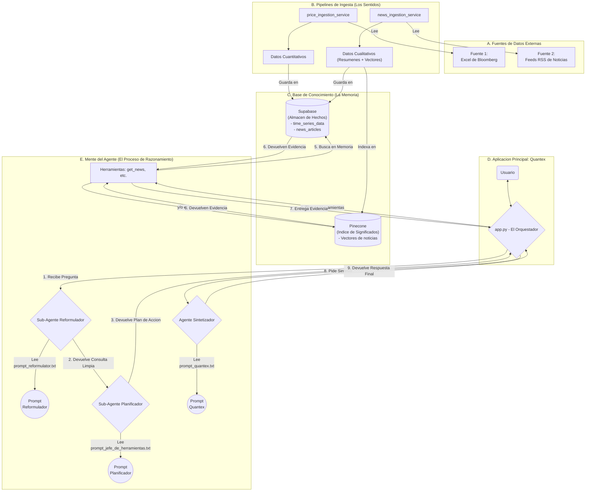

# Arquitectura Completa del Ecosistema Quantex

Este diagrama representa el flujo completo de datos y razonamiento del sistema `Quantex`, desde las fuentes de datos externas hasta la respuesta final entregada al usuario.

La arquitectura se basa en un modelo de agentes y sub-agentes modulares, donde cada componente tiene una responsabilidad única y bien definida.

### Explicación de los Componentes
* **A. Fuentes de Datos:** Origen de la información cruda.
* **B. Pipelines de Ingesta:** Servicios automáticos que procesan y preparan los datos.
* **C. Base de Conocimiento:** La memoria dual del sistema, separando hechos (Supabase) de significados (Pinecone).
* **D. Aplicación Principal:** El punto de entrada y el orquestador que dirige todo el proceso.
* **E. Mente del Agente:** El flujo de razonamiento interno, mostrando la cadena de mando desde que se recibe una pregunta hasta que se genera una respuesta, pasando por la reformulación, la planificación, la ejecución de herramientas y la síntesis final.