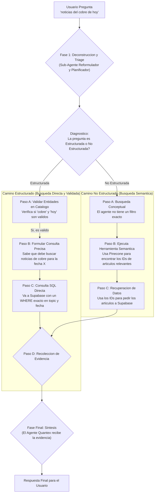

# Diagrama de Flujo: La Mente de Quantex (Arquitectura de Triage)

Este diagrama detalla el proceso de razonamiento completo que sigue el agente `Quantex` para responder a una pregunta del usuario, implementando una arquitectura de "Triage" para diferenciar entre peticiones estructuradas y no estructuradas.

### Explicación de esta Arquitectura

Este flujo representa un agente de IA de última generación:

1.  **Triage Inteligente:** No trata todas las preguntas por igual. Primero, diagnostica la naturaleza de la petición para decidir la ruta más eficiente.
2.  **Ruta Rápida (Estructurada):** Para preguntas directas, valida los datos y va directamente a la base de datos con una consulta precisa, lo que es rápido y fiable.
3.  **Ruta Creativa (No Estructurada):** Para preguntas abiertas, utiliza el poder de la búsqueda semántica (Pinecone) para encontrar conexiones conceptuales y descubrir información relevante que una búsqueda normal no encontraría.

Esta arquitectura dual hace que `Quantex` sea a la vez **eficiente** y **profundamente inteligente**.